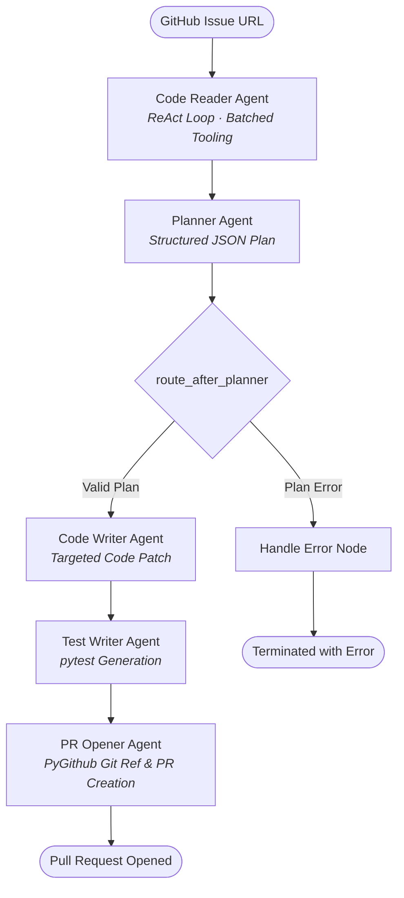

# GitResolve: Autonomous Multi-Agent Issue Resolution Pipeline

An autonomous software engineering pipeline built with **LangGraph** that takes a GitHub issue URL, investigates the target codebase using polyglot AST symbol parsing, drafts a structured patch, generates verification test suites, and opens a Pull Request via GitHub's API.

---

## Architecture & Workflow

The workflow is orchestrated as a stateful cyclic graph in **LangGraph**. Agents communicate strictly through a unified state schema (`AgentState`), decoupling execution logic and enabling clean state recovery and error handling.



---

## Technical Architecture

### 1. Code Reader (`agents/code_reader.py`)
Explores and inspects remote repositories to pinpoint the root cause of an issue.
- **Batched ReAct Execution**: Unlike traditional single-action loops, the agent can issue multiple tool calls in a single reasoning step (e.g., parallel keyword greps), minimizing LLM round-trip latency.
- **Lazy AST Symbol Parsing**: Uses `tree-sitter` grammars (Python, JavaScript, TypeScript, Go) to index functions, methods, and classes on-demand rather than pre-indexing entire repositories.
- **Targeted Line Reading**: Queries precise line ranges via `read_lines()` based on AST symbol coordinates, preventing context window bloat from full file dumps.
- **Loop Safeguards**: Enforces a strict turn cap (`MAX_TURNS = 4`) and requires dedicated reporting turns to prevent hallucinated conclusions during exploratory actions.

### 2. Planner (`agents/planner.py`)
Synthesizes the issue context and exploration transcript into a concrete action plan.
- Emits structured JSON defining exact files to modify, steps to follow, and confidence levels.
- Supports dynamic conditional routing: low confidence or malformed plans route to `handle_error` instead of generating invalid pull requests.

### 3. Code Writer (`agents/code_writer_agent.py`)
Generates the patch based on the planner's specifications.
- Identifies file languages and emits structured `FILE: <filepath>` blocks for multi-file edits.
- Operates on precise line context to produce minimal, reviewable code modifications.

### 4. Test Writer (`agents/test_writer_agent.py`)
Generates complementary test cases (`pytest`) targeting the reported issue.
- Drafts regression tests that exercise the targeted code path and common edge cases.
- Emits test scripts under `tests/test_generated_fix.py` to be committed alongside code changes.

### 5. PR Opener (`agents/pr_opener_agent.py`)
Automates the Git and GitHub integration.
- Creates an isolated branch (`fix/issue-auto-<sanitized-title>-<uuid>`) from the default branch.
- Parses generated code blocks and commits the modifications using the GitHub REST API.
- Opens a Pull Request containing the issue context, resolution plan, and summary.

---

## Tech Stack

- **Pipeline Orchestration**: LangGraph (`StateGraph`, conditional edges)
- **Language Model**: Google Gemini (`gemini-3.1-flash-lite` via `langchain-google-genai`)
- **AST Parsing**: `tree-sitter` with grammars for Python, JavaScript, TypeScript, and Go
- **Version Control API**: `PyGithub`
- **Testing**: `pytest`

---

## Project Structure

```
├── agents/
│   ├── code_reader.py         # ReAct investigation loop & symbol parsing
│   ├── planner.py             # Plan construction & workflow routing
│   ├── code_writer_agent.py   # Source code patch synthesis
│   ├── test_writer_agent.py   # pytest regression suite generation
│   ├── pr_opener_agent.py     # Git branch commits & GitHub PR publishing
│   └── handle_error.py        # Failure handling and state recording
├── utils/
│   ├── repo_tools.py          # Tree-sitter parser, grep, and targeted line reader
│   ├── commit.py              # PyGithub branch and commit operations
│   ├── parser.py              # Block extractor for file patches
│   └── llm_res_formater.py    # Output normalizer
├── state.py                   # AgentState schema and configuration
├── main.py                    # Graph compilation and CLI entry point
├── .env.example               # Environment variable template
└── requirements.txt           # Project dependencies
```

---

## Setup & Usage

### 1. Installation

```bash
git clone https://github.com/Suyash-Pradhan/Github-agent-Test.git
cd Github-agent-Test

python -m venv venv
# Linux/macOS:
source venv/bin/activate
# Windows:
venv\Scripts\activate

pip install -r requirements.txt
```

### 2. Environment Configuration

Create a `.env` file based on `.env.example`:

```env
GITHUB_TOKEN=your_github_personal_access_token
GOOGLE_API_KEY=your_google_gemini_api_key
```

**Required GitHub Token Permissions**:
- `Contents`: Read & Write (to commit file changes and create branches)
- `Pull Requests`: Read & Write (to create pull requests)
- `Issues`: Read-only (to fetch issue details)

### 3. Run

```bash
python main.py --issue-url https://github.com/owner/repository/issues/42
```

---

## Known Constraints

- **AST Symbol Extraction**: Full AST indexing is currently implemented for Python, JavaScript, TypeScript, and Go; other languages use grep-based search fallback.
- **Test Generation Runtime**: Generated test suites are formatted for `pytest`. In non-Python repositories, tests provide verification logic templates rather than natively executable suites.
- **Repository Scope**: Capped at 4 exploration turns to balance token efficiency against deep repository traversals.
